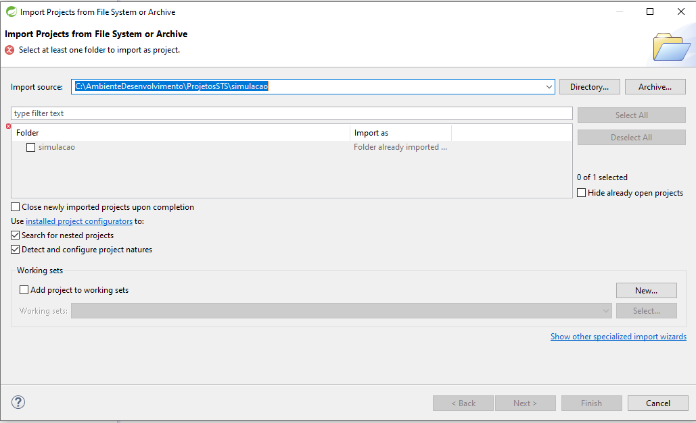
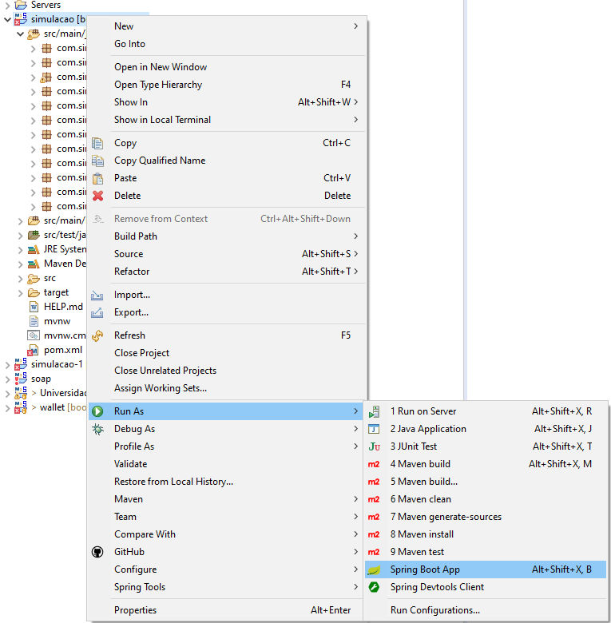
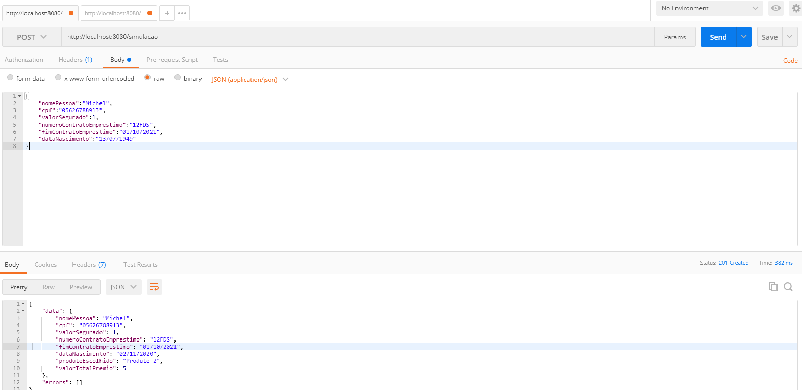
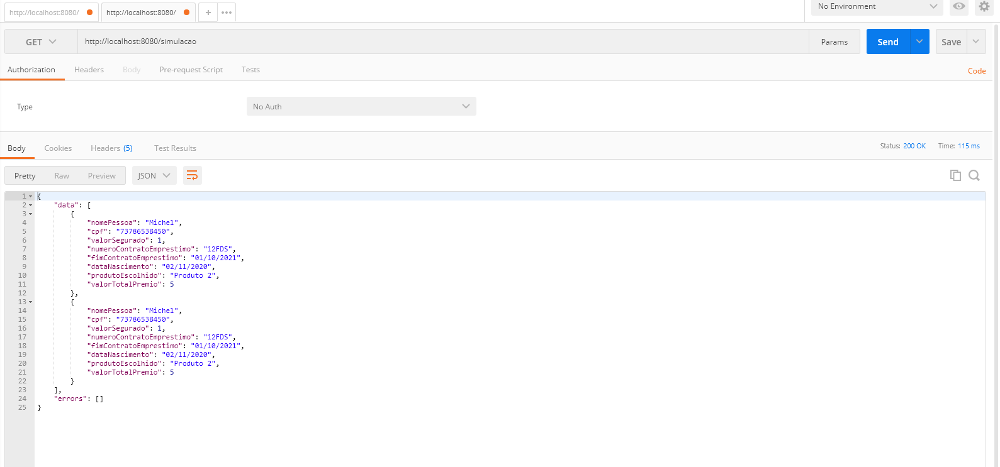

# AppSimulacao
### Executar JAR gerado
0. Instalar JDK java 1.8.0_201 ou mais.
1. Baixar arquivo em: https://drive.google.com/file/d/1u5gy2X8wLbw_x9wiis78Wt_7hT9zuQ0G/view?usp=sharing
2. Executar com o comando na pasta do arquivo: java -jar simulacao-cresol-0.0.1-SNAPSHOT.jar

### Executar pelo Spring Tools
0. Instalar JDK java 1.8.0_201 ou mais
1. Baixar e instalar: https://spring.io/tools
2. Clonar projeto: git clone https://github.com/michelzarpe/simulacao
3. Importar na ferramenta: File > Open Projects from File System... Achar pasta do projeto > depois em folder clicar no nome do projeto e finish.

4. Executar:

### Url da Api para executar postman
1. POST http://localhost:8080/simulacao

2. GET http://localhost:8080/simulacao
